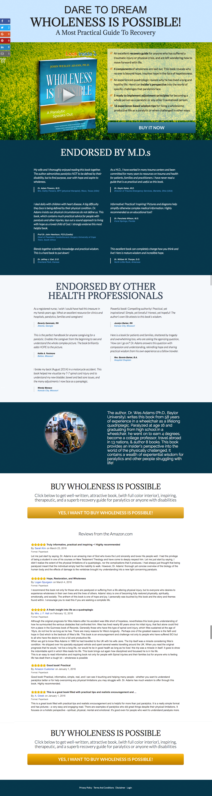
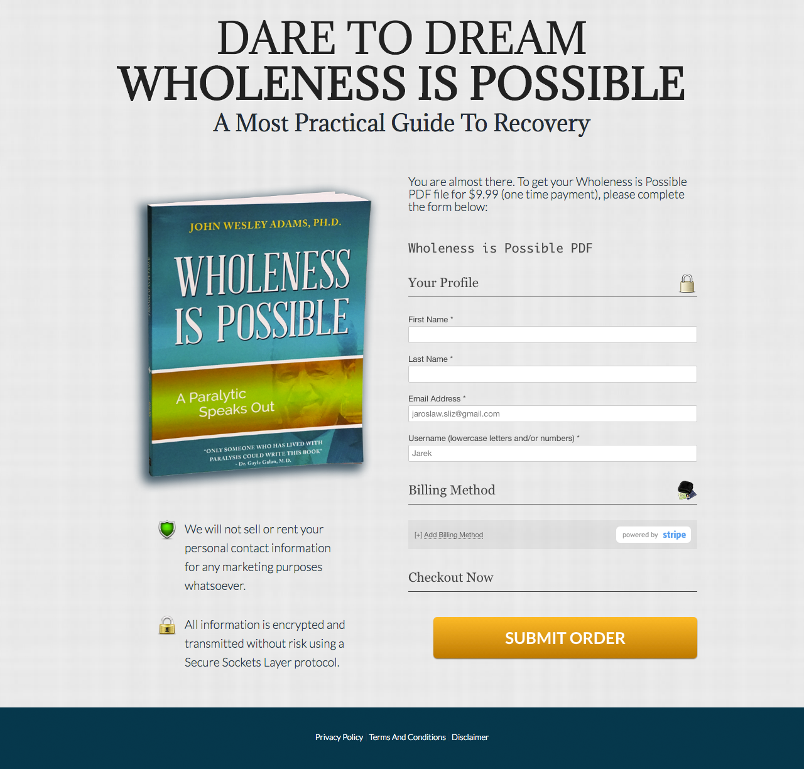

## Wholeness Landing Page
Landing page for author's Book "Wholeness is Possible" and main purpuse for that page is to practice coding skills.

Website should have options to buy either hardcopy or digital pdf version and after purchase collect information about buyers and transaction. 

If user choose digital copy, than should have an option to download PDF file with the book.

## Motivation
Oryginal website is builded on Wordpress http://wholenessispassible.com and I want to learn how to use Angular.js and Bootstrap instead CMS and also add Javascript features.

## Screenshots

###Home Page

###Checkout Page

## Contributors
I'm very open for any suggestion how can I improve my code in terms of simplicy, functionality and code design. 

